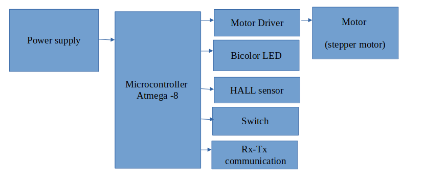

# Orbit-Level-sensor
Commercial Project  
Sapcon Instrumrnts Pvt.Ltd. 
https://www.sapconinstruments.com/

#  Orbit-Level-Sensor (Commercial Project)

An embedded industrial system based on a **rotating paddle level sensor** for solid material detection.  
Designed for applications such as **silos, hoppers, bins, and bulk solid containers**.

---

## Official Sensor Reference

This project is inspired by / based on the industrial product below:

 **Orbit-Lite Rotating Paddle Level Sensor (Sapcon Instruments)**  
https://www.sapconinstruments.com/products/Orbit-Lite-Rotating-Paddle-Level-Sensor-for-solidsin

---

##  System Block Diagram

> Ensure the image file is present in the repository root or update the path accordingly.

---

## System Architecture

The system is built around an **ATmega8 microcontroller**, which controls motor operation, monitors feedback sensors, and manages communication.

### Main Blocks:

- **Power Supply**  
  Provides regulated power to MCU, motor driver, and peripherals.

- **Microcontroller (ATmega8)**  
  Responsible for:
  - Motor control logic  
  - Hall sensor monitoring  
  - Switch input handling  
  - Status indication  
  - Serial communication  

- **Motor Driver + Stepper Motor**  
  Drives the rotating paddle mechanism used for level detection.

- **Hall Sensor**  
  Used for:
  - Rotation feedback  
  - Stall detection  
  - Fault condition monitoring  

- **Bicolor LED**  
  Indicates system states such as:
  - Normal operation  
  - Material detected  
  - Fault condition  

- **Switch**  
  Used for calibration, reset, or configuration.

- **Rx–Tx Communication**  
  Enables debugging, configuration, and external monitoring.

---

## Working Principle

1. The **stepper motor** continuously rotates the paddle.
2. When bulk material reaches the paddle, its rotation is obstructed.
3. The **Hall sensor** detects a change in rotation.
4. The **ATmega8 microcontroller** processes this signal.
5. The system updates:
   - Motor control  
   - LED status  
   - Communication output  

This ensures reliable **presence or absence detection of solid materials**.

---

## Applications

- Grain silos  
- Cement and powder hoppers  
- Plastic granule bins  
- Food processing storage systems  
- Industrial bulk material handling  

---

